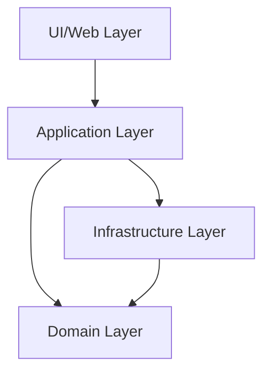

# RecruitReply Source Code

## Clean Architecture

This project follows Clean Architecture principles with a clear separation of concerns:

## Directory Structure

The codebase is organized into the following directories:

### Core Architecture Layers
- **domain/**: Core business logic and domain models
  - `models/`: Domain entities and value objects
  - `repositories/`: Repository interfaces
  - `services/`: Domain service interfaces
  - `errors/`: Domain-specific errors

- **application/**: Application services and use cases
  - `services/`: Application services implementing use cases
  - `dtos/`: Data Transfer Objects for inputs/outputs
  - `errors/`: Application-specific errors
  - `utils/`: Application-level utilities

- **infrastructure/**: Infrastructure implementations
  - `repositories/`: Repository implementations
  - `cloudflare/`: Cloudflare-specific implementations
  - `persistence/`: Database and storage implementations
  - `http/`: HTTP client implementations
  - `factories/`: Factory implementations
  - `mocks/`: Mock implementations for testing

### Frontend-specific Structure
- **app/**: Next.js App Router
  - `api/`: API route handlers
  - `(routes)/`: Application routes
  - `layout.tsx`: Root layout
  - `page.tsx`: Home page

- **components/**: Reusable React components
  - `layout/`: Layout components
  - `ui/`: UI components

- **features/**: Feature-based modules
  - `auth/`: Authentication functionality
  - `chat/`: Chat functionality
  - `documents/`: Document management

- **hooks/**: Custom React hooks

### Shared Code
- **lib/**: Shared utilities
  - `utils/`: Generic utility functions
  - `constants/`: Application constants
  - `config/`: Configuration files

- **types/**: TypeScript type definitions and interfaces

## Testing Structure
The tests mirror the source code structure:

- **__tests__/**: Test files
  - `unit/`: Unit tests for components and functions
  - `integration/`: Integration tests for API routes
  - `e2e/`: End-to-end tests for user flows

## Best Practices
- Each module should have a clear responsibility (Single Responsibility Principle)
- Depend on abstractions, not concretions (Dependency Inversion Principle)
- Use interfaces to define boundaries between layers
- Keep domain logic free from infrastructure concerns
- Co-locate tests with the code they test
- Follow consistent naming conventions
- Avoid circular dependencies
- Use dependency injection for better testability

## Utilities and Shared Code

- `src/lib/` - Shared utilities and functions
- `src/components/` - Shared UI components
- `src/hooks/` - Custom React hooks 